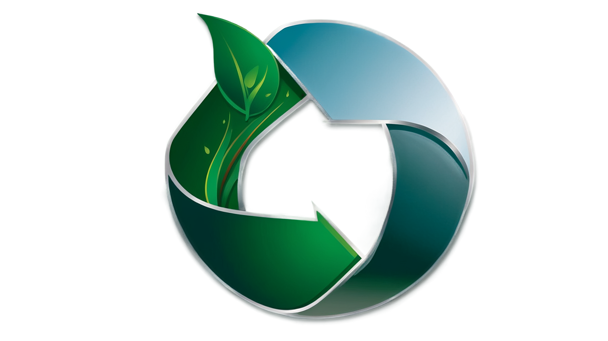

# LVuRác - Ứng dụng Quản lý Chất thải



LVuRác là một ứng dụng di động được phát triển bằng Flutter để giúp người dùng quản lý chất thải hiệu quả, tìm kiếm điểm thu gom, phân loại rác thải và nhận điểm thưởng cho các hoạt động tái chế.

## Tính năng chính

- **Bản đồ điểm thu gom**: Hiển thị và tìm kiếm các điểm thu gom rác thải gần bạn
- **Phân loại rác thải**: Hướng dẫn chi tiết về cách phân loại các loại rác thải khác nhau
- **Quản lý giao dịch**: Theo dõi các giao dịch thu gom rác thải của bạn
- **Hệ thống điểm thưởng**: Nhận và sử dụng điểm thưởng cho các hoạt động tái chế
- **Thống kê tái chế**: Theo dõi tiến trình và thành tích tái chế của bạn
- **Trợ lý AI**: Trả lời các câu hỏi về quản lý chất thải và tái chế
- **Hỗ trợ đa ngôn ngữ**: Giao diện được hỗ trợ nhiều ngôn ngữ khác nhau

## Yêu cầu hệ thống

- Flutter SDK: ^3.5.0
- Dart SDK: ^3.5.0
- Android: SDK 21+ (Android 5.0+)
- iOS: iOS 12+

## Cài đặt

1. Clone repository:

```bash
git clone https://github.com/your-username/wasteanmagement.git
cd wasteanmagement
```

2. Cài đặt các dependencies:

```bash
flutter pub get
```

3. Tạo file `.env` tại thư mục gốc của dự án:

```
OPENAI_API_KEY=your_api_key_here
MAPBOX_ACCESS_TOKEN=your_mapbox_token_here
```

4. Chạy ứng dụng:

```bash
flutter run
```

## Cấu hình API key cho trợ lý AI

Ứng dụng LVuRác bao gồm tính năng trợ lý AI được tích hợp với OpenAI API. Để sử dụng tính năng này, bạn cần cấu hình API key của OpenAI trong file `.env`.

### Các bước thực hiện:

1. Đăng ký tài khoản tại [OpenAI](https://platform.openai.com/) nếu bạn chưa có
2. Tạo API key mới từ trang [API Keys](https://platform.openai.com/api-keys)
3. Tạo file `.env` tại thư mục gốc của dự án (nếu chưa có)
4. Thêm dòng sau vào file `.env`:

```
OPENAI_API_KEY=your_api_key_here
```

5. Thay thế `your_api_key_here` bằng API key bạn vừa tạo
6. Chạy lại ứng dụng để áp dụng thay đổi

## Cấu hình Mapbox cho bản đồ

Ứng dụng sử dụng Mapbox để hiển thị bản đồ điểm thu gom. Để sử dụng tính năng này, bạn cần cấu hình Mapbox access token:

1. Đăng ký tài khoản tại [Mapbox](https://www.mapbox.com/)
2. Tạo access token mới từ trang dashboard
3. Thêm dòng sau vào file `.env`:

```
MAPBOX_ACCESS_TOKEN=your_mapbox_token_here
```

4. Thay thế `your_mapbox_token_here` bằng token bạn vừa tạo

## Kiến trúc ứng dụng

LVuRác được xây dựng theo kiến trúc BLoC (Business Logic Component) với các thành phần chính:

- **Presentation Layer**: Màn hình và widgets (trong thư mục `lib/screens` và `lib/widgets`)
- **Business Logic Layer**: BLoCs và Cubits (trong thư mục `lib/blocs`)
- **Data Layer**: Repositories và Data Sources (trong thư mục `lib/repositories` và `lib/data`)
- **Domain Layer**: Models (trong thư mục `lib/models`)

## Chức năng Trợ lý AI

Trợ lý AI được cấu hình để chỉ trả lời các câu hỏi liên quan đến quản lý chất thải, phân loại rác, tái chế, bảo vệ môi trường và các chủ đề liên quan đến ứng dụng. Người dùng có thể truy cập trợ lý AI này thông qua:

- Nút trợ lý AI trên màn hình chính
- Mục trợ lý AI trong màn hình Trợ giúp & Hướng dẫn

**Lưu ý**: Đảm bảo giữ bí mật API key của bạn và không chia sẻ nó với người khác. API key này sẽ được lưu trữ cục bộ trên thiết bị của bạn và chỉ được sử dụng để gửi yêu cầu đến OpenAI API.

## Đóng góp

Chúng tôi rất hoan nghênh mọi đóng góp cho dự án LVuRác. Nếu bạn muốn đóng góp, vui lòng:

1. Fork repository
2. Tạo branch mới (`git checkout -b feature/amazing-feature`)
3. Commit các thay đổi của bạn (`git commit -m 'Add some amazing feature'`)
4. Push lên branch (`git push origin feature/amazing-feature`)
5. Tạo Pull Request

## Giấy phép

Dự án này được phân phối theo giấy phép MIT. Xem file `LICENSE` để biết thêm thông tin.

## Liên hệ

Nếu bạn có bất kỳ câu hỏi hoặc góp ý nào, vui lòng liên hệ với chúng tôi qua email: support@lvurac.com
